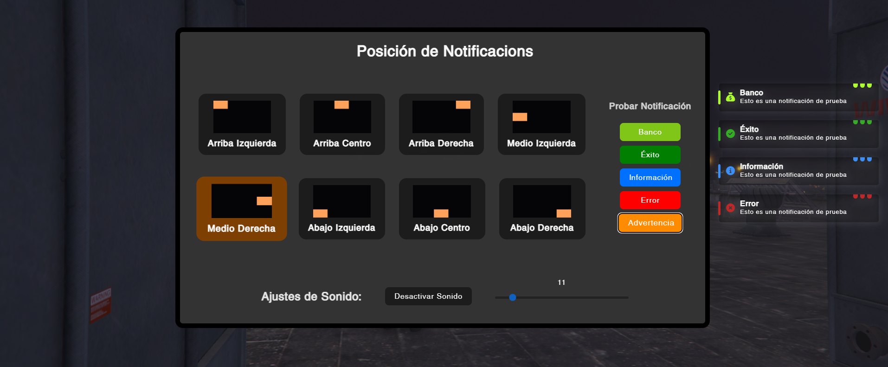

# lforge_notifications

 
 

 

> [!WARNING]
> Any appearance similarity to other scripts is just coincidence. This script has been made from scratch.

This FiveM notification script provides fully configurable notifications for each player, offering categories like banking, info, error, warning, and success alerts. The script allows each player to customize the notifications sound volume and position to enhance the in-game experience, ensuring players receive the right information in the right place.

## 📢 Features

- Mute/unmute notification sounds.
- Change volume of notification sounds.
- Change notification position to one of our presets.
- Modern and fluid.
- Semitransparent to not intefere with the screen content.
- Customization interface.
- Totaly Open-Source
- Fluid in-out animations.

## ⚙️ Installation

Access to the <a href="https://lionforge.gitbook.io/LionForge5M/paid-scripts/lforge-notifications">docs</a> to know how to install and set up the script.

## 📷 Showcase

## 🔊 Sounds

### Info

https://github.com/LionForge5M/lforge_notifications/blob/main/html/sounds/info.mp3?raw=true

### Success

https://github.com/LionForge5M/lforge_notifications/blob/main/html/sounds/success.mp3?raw=true

### Error

https://github.com/LionForge5M/lforge_notifications/blob/main/html/sounds/error.mp3?raw=true

### Warning

https://github.com/LionForge5M/lforge_notifications/blob/main/html/sounds/warning.mp3?raw=true

### Bank

https://github.com/LionForge5M/lforge_notifications/blob/main/html/sounds/bank.mp3?raw=true

## 🧞 Commands

|     | Command      | Action                                      |
| :-- | :----------- | :------------------------------------------ |
| ⚙️  | `/notifymenu` | Open the notification's customization menu. |

## 📡 Exports

|     | Command      | Action                                      | Arguments                                    |
| :-- | :----------- | :------------------------------------------ | :--------------------------------------------|
| ⚙️  | `NewNotification` | Send a new notification. | **message:** string -> Text of the notification   **notifyType:** string? -> Type of the notification (info, success, warning, error, bank)   **duration:** number? -> Time that the notification will be visible   **icon:** string? -> Fontawsome icon   **title:** string? -> Title of the notification |

 *If the argument type has and "?" it means that is optional.

## 📄 Changelog

### 1.1.0

> -   Changed notification menu background color.

### 1.0.0

> -   Intial Release

## 🤝 Contributing

